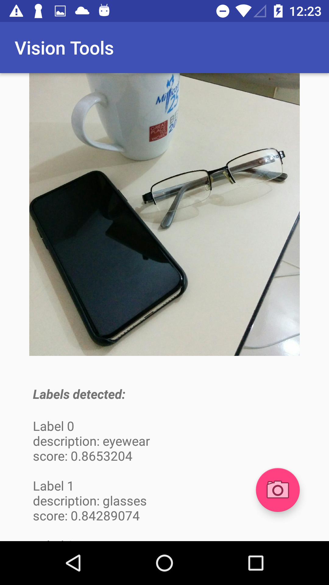

# Vision Tools
Android application to explore Google Vision API features.

## Overview
This application lets you assess Google Vision API functionalities such as text, face and context detection.

## Text Detection
You can take a picture of a piece of handwritten or printed text and make a call to Google Vision API in order to get all the text information contained in the image.

  

## Label Detection
Find out what categories objects in a photo belong to.

 

## Face Detection
Detect and evaluate people's facial expressions with this feature.

 

## Instructions
1. Start a project in Google Cloud Console.
2. Activate Vision API for your project.
3. Create an API key to make authenticated calls to Vision API on behalf of your cloud project.
4. Insert that API key in TextDetection, LabelDetection and FaceDetection Activities (look for the string 'CLOUD_VISION_API_KEY').

That's it! You can start exploring new uses of this technology in your own applications.
